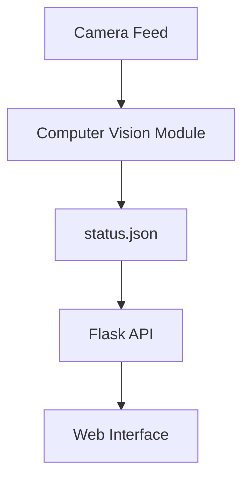

# Smart Parking System 🚗🅿️


A real-time computer vision solution for monitoring parking space availability using AI object detection.


## Demo Video:

https://github.com/user-attachments/assets/2faa13de-c75f-4334-b62b-c932f4a56929


## Table of Contents
- [Features](##✨Features)
- [System Architecture](#-system-architecture)
- [Installation](#-installation)
- [Raspberry Pi Integration](#-Optional)
- [Configuration](#-configuration)
- [Usage](#-usage)
- [Troubleshooting](#-troubleshooting)

## ✨ Features
- Real-time vehicle detection using YOLOv8
- Visual parking space status (Green=Available, Red=Occupied)
- REST API for integration with web/mobile apps
- Simple web interface for monitoring
- Customizable parking space layout

## 🏗 System Architecture


## ⚙️Installation

### Prerequisites
- Python 3.8+
- Webcam or IP camera
- OpenCV
- Flask
- Ultralytics YOLOv8
- Tkinter
- PIL (Pillow)
- NumPy

### Setup
1. Clone the repository:
```bash
git clone https://github.com/Yae_sine/smart-parking-system.git
cd smart-parking-system
```
2. Install dependencies:
```bash
   pip install -r requirements.txt
```

### Raspberry Pi Integration (Optional)
The Raspberry Pi component of this project is optional. You can run the AI detection system and web interface without it.

The Raspberry Pi adds the following physical features to the smart parking system:
- **LED Indicators**: 
  - Red LED illuminates when all parking spots are occupied
  - Green LED illuminates when at least one spot is available
- **Barrier Control**: 
  - Works with ESP32 to control entry/exit barriers
  - Automatically opens when a car approaches

#### Raspberry Pi Setup Requirements
If you choose to implement the Raspberry Pi component, you'll need:

#### Hardware
- Raspberry Pi (3B+ or newer recommended)
- LED indicators (red and green)
- Jumper wires
- Resistors (220-330Ω)
- ESP32 microcontroller for barrier control
- Servo motors for barriers
- IR or ultrasonic sensors for car detection

#### ESP32 Requirements
- Arduino IDE with ESP32 board support
- Required Libraries:
  - WiFi
  - PubSubClient (for MQTT)
  - Servo

#### Communication
- The Raspberry Pi communicates with the main system via HTTP requests to get parking status updates
- Controls the physical indicators based on parking availability
- The ESP32 handles barrier control based on:
  - Signals from proximity sensors
  - Commands from the Raspberry Pi
 ## ⚙️ Configuration:
 ### Parking space configuration:
 ```bash
  -px_per_cm = 37.8                # Pixel to cm ratio
  -spot_height = int(5.5 * px_per_cm)  # Spot height in pixels
  -spot_width = int(4.2 * px_per_cm)   # Spot width in pixels
  -spot_spacing = int(0.4 * px_per_cm) # Space between spots
  ```
  ### Camera settings:
  ```bash
  camera_index = 0                 # Change if using different camera
  ```

## 🚀 Usage
### Running the System
Start the computer vision module:

 ```bash
python AI/main.py
 ```
Start the Flask server (in another terminal):
 ```bash
python FlaskPrj/app.py
 ```
Access the web interface at:
 ```bash
http://localhost:5000
 ```


## 🚨 Troubleshooting

| Issue                      | Solution                                                                 |
|----------------------------|--------------------------------------------------------------------------|
| Camera not detected        | Try changing `camera_index` in `main.py`                                 |
| YOLOv8 model not found     | Verify `yolov8s.pt` is in the `AI` folder                               |
| Module import errors       | Check all dependencies are installed (`pip install -r requirements.txt`) |
| Flask server not starting  | Ensure port 5000 is available or change the port in `app.py`            |


## 🤝 Contributing:
Pull requests are welcome! For major changes, please open an issue first.


